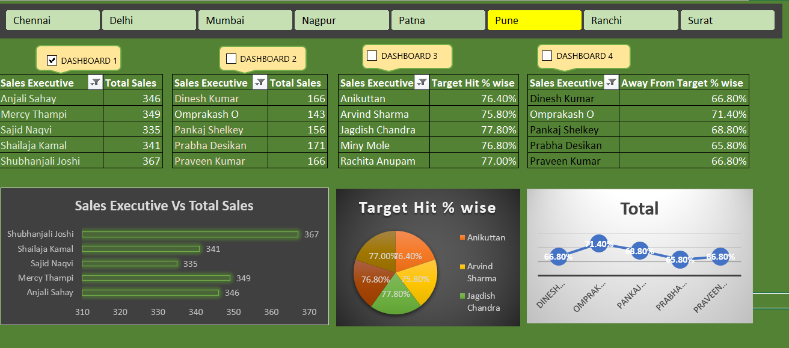

# Sales-Executive-performance-Analysis-Macros-Enabled

# 📊 Sales Executive Performance Dashboard (Excel + Macros)

## 🏷️ 1.Project Title

**Sales Executive Performance Dashboard using Microsoft Excel & VBA Macros**

---

## 📌 2.Short Description

This project is an interactive **Sales Executive Performance Dashboard** built in **Microsoft Excel** using **VBA Macros**. It provides insights into sales performance, target achievement, and executive-level efficiency across different cities. The dashboard enables dynamic filtering, comparison, and performance tracking.

---

## 🛠️ 3.Tech Stack

* **Microsoft Excel**
* **VBA (Visual Basic for Applications)**
* **Excel Charts & Pivot Tables**
* **Macros for automation and interactivity**

---

## 📂4.Data Source

* The dataset used in this project is taken from **random online sources** for practice and learning purposes.

---

## ✨5.Features & Highlights

### 🔹 Interactive Dashboard

* City-wise filtering (Chennai, Delhi, Mumbai, Nagpur, Patna, Pune, Ranchi, Surat)
* Toggle between multiple dashboards using checkboxes

### 🔹6.Performance Tracking

* Top-performing sales executives
* Bottom-performing executives
* Total sales comparison

### 🔹 7.Visual Insights

* Bar charts for sales comparison
* Pie chart for target achievement %
* Line chart for performance gaps

### 🔹 8.Automation

* Macros used for:

  * Dashboard switching
  * Dynamic data updates
  * Enhanced user experience

---

## 💼 9.Business Problem

Organizations often struggle to:

* Track individual sales executive performance
* Identify top and low performers quickly
* Monitor target achievement across regions

This dashboard solves these problems by providing **clear, visual, and actionable insights**.

---

## 🎯 10.Goal of the Dashboard

* Analyze **sales performance across executives**
* Compare **target achievement percentages**
* Identify **top 5 and bottom 5 performers**
* Enable **city-wise performance analysis**

---

## ❓11.Key Questions Answered

* Who are the **Top 5 Sales Executives** based on total sales?
* What is the **Total Sales** achieved?
* Which city is performing the best?
* What is the **Target Hit %** for each executive?
* Who are the **Bottom 5 Sales Executives**?
* Which executives are **away from target** the most?

---

## 📊 Key Insights

* 📈 **Top 5 Executives** contribute significantly to overall sales
* 📉 Bottom performers show higher deviation from targets
* 🎯 Target achievement varies across executives and cities
* 🏙️ City-wise filtering helps identify regional performance gaps

---

## 🖼️ Dashboard Screenshot

> **sales_executives_screenshot.png**

---

## 🚀 How to Use

1. Download the Excel file
2. Enable Macros
3. Use city filters and dashboard toggles
4. Explore insights through charts and tables

---

## 📢 Conclusion

This project demonstrates how **Excel + VBA Macros** can be used to build a powerful and interactive business dashboard for performance analysis and decision-making.

---
